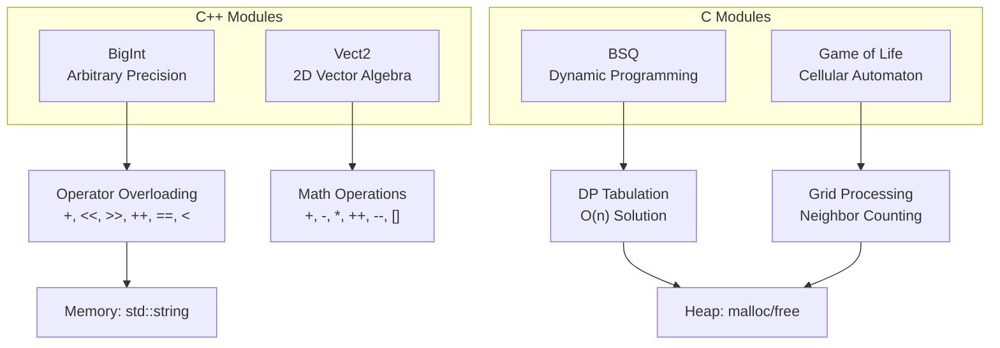

# 🧮 Exam Exercises

[](https://en.wikipedia.org/wiki/C_(programming_language))
[](https://en.wikipedia.org/wiki/C%2B%2B)
[](https://en.wikipedia.org/wiki/Algorithm)
[](https://en.wikipedia.org/wiki/Dynamic_programming)
[](https://en.wikipedia.org/wiki/Memory_management)
[](https://en.wikipedia.org/wiki/Operator_overloading)

> Colección de ejercicios de algoritmos y estructuras de datos implementados en C y C++, diseñados para demostrar dominio de programación de bajo nivel, gestión manual de memoria, optimización algorítmica y técnicas avanzadas de programación orientada a objetos.

---

## 🎯 Características Principales

| Módulo | Descripción | Complejidad |
|--------|-------------|-------------|
| **BigInt** | Enteros de precisión arbitraria con sobrecarga completa de operadores aritméticos, bitwise, comparación y flujos I/O | O(n) adición |
| **Vect2** | Clase vector 2D con álgebra vectorial completa mediante sobrecarga de operadores | O(1) operaciones |
| **Game of Life** | Simulación del autómata celular de Conway con procesamiento de grid y renderizado en terminal | O(w×h×n) iteraciones |
| **BSQ** | Algoritmo de programación dinámica para encontrar el cuadrado más grande libre de obstáculos | O(n) tiempo y espacio |

---

## 🛠️ Stack Tecnológico

| Categoría | Tecnología | Propósito |
|-----------|------------|-----------|
| **Lenguaje Principal** | C (C11) | Implementación de bajo nivel, punteros, gestión manual de memoria |
| **Lenguaje OO** | C++ (C++17) | Programación orientada a objetos, templates, sobrecarga de operadores |
| **Compilador** | GCC / g++ | Compilación, debugging, optimización |
| **Estándar** | POSIX | Entrada/salida estándar, manejo de archivos |

---

## 🧠 Decisiones Técnicas y Arquitectura

Este proyecto utiliza **C y C++ de forma estratégica** según el dominio del problema:

- **C puro** para BSQ y Game of Life permite demostrar competencias fundamentales evaluadas en procesos técnicos rigurosos: implementación manual de `getline()`, aritmética de punteros, y algoritmos de **programación dinámica con tabulación** que operan en O(n) sobre estructuras de datos lineales.

- **C++ moderno** para BigInt y Vect2 showcase de programación orientada a objetos y **metaprogramación**: sobrecarga de operadores (`+`, `<<`, `>>`, `[]`, `++`, `--`), friend functions para streaming, y encapsulación correcta siguiendo el principio de mínima sorpresa.

La implementación del algoritmo BSQ utiliza **programación dinámica bottom-up**, donde cada celda `dp[y][x]` almacena el tamaño del cuadrado más grande terminando en esa posición, computado en una sola pasada.



---

## 📁 Estructura del Proyecto

```
exam-exercises/
├── bigint/
│   ├── bigint.hpp      # Header con declaración de clase
│   ├── bigint.cpp      # Implementación de operadores
│   └── main.cpp        # Tests y demostración
├── vect2/
│   ├── vect2.hpp       # Header con declaración de clase
│   ├── vect2.cpp       # Implementación de álgebra vectorial
│   └── main.cpp        # Tests y demostración
├── gameoflife/
│   └── main.c          # Autómata celular completo
├── bsq/
│   ├── main.c          # Algoritmo BSQ + getline custom
│   └── bsq_test_maps/  # Mapas de prueba
└── README.md
```

---

## 🚀 Instalación y Uso

### Requisitos Previos

- GCC (para C) o G++ (para C++)
- Sistema POSIX (Linux/macOS) o MSYS2 en Windows

### Compilación Rápida

```bash
# 📊 BigInt - Enteros de precisión arbitraria
g++ -std=c++17 bigint/main.cpp bigint/bigint.cpp -o bigint_demo && ./bigint_demo

# 📐 Vect2 - Álgebra vectorial 2D  
g++ -std=c++17 vect2/main.cpp vect2/vect2.cpp -o vect2_demo && ./vect2_demo

# 🎮 Game of Life - Autómata celular
gcc gameoflife/main.c -o gameoflife && echo "aaaaawwwdwddddsx" | ./gameoflife 10 10 5

# 🗺️ BSQ - Mayor cuadrado libre
gcc bsq/main.c -o bsq && ./bsq bsq/bsq_test_maps/map_valid_1.txt
```

### Ejemplo de Salida (BSQ)

```text
# Entrada (map_valid_1.txt):
5 . o x
.....
.....
..o..
.....
.....

# Salida:
xxxxx
xxxxx
..o..
xxxxx
xxxxx
```

---

## 📚 Conceptos Demostrados

| Área | Conceptos |
|------|-----------|
| **Algoritmos** | Dynamic Programming, Tabulation, Grid Processing |
| **Memory** | Manual allocation (malloc/free), Custom getline implementation |
| **C++ OOP** | Operator Overloading, Friend Functions, Copy Constructors |
| **Low-level** | Pointer Arithmetic, File I/O, stdin/stdout |

---

## 👤 Contacto

[](https://github.com/samuelhm/)
[](https://www.linkedin.com/in/shurtado-m/)